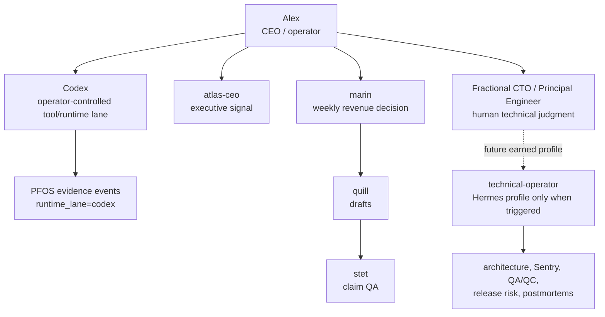

# Technical Operator Boundary Plan

Date: 2026-05-20  
Source ADR: `_meta/decisions/2026-05-20-reserve-codex-for-tool-use-technical-operator-profile.md`

## Goal

Fit the org-structure decision into the Hermes operating system without overbuilding: reserve `Codex` for the OpenAI tool/runtime lane, stop treating `hermes/profiles/codex/` as a fleet identity, and define the future `technical-operator` boundary before agency-skill consolidation is blessed.

## Hermes OS Fit

## Specific Plan

1. ADR source of truth
   - Add a dated ADR superseding the `codex` Hermes profile concept.
   - Reserve `Codex` for tool/lane use only.
   - Define `technical-operator` as the future CTO/governance profile boundary.

2. Agency consolidation guard
   - Before committing agency skills, review all dirty edits under `hermes/profiles/codex/`.
   - Do not commit `codex` as an active profile owner.
   - Park engineering/testing Agency skills as future `technical-operator` candidates or leave them unowned.

3. Later focused cleanup
   - Update root routing docs and capability roadmap references from `codex profile rebuild` to `technical-operator boundary`.
   - Mark `_meta/ORG-CHART.md` as historical/pre-pivot if it is still consulted.
   - Create `hermes/profiles/technical-operator/` only if the profile trigger fires.

## Acceptance Checks

- ADR exists under `_meta/decisions/`.
- ADR explicitly says `profile: codex` / `agent_id: codex` are disallowed.
- ADR preserves `runtime_lane: codex` for operator-controlled evidence.
- ADR names the future `technical-operator` scope and non-goals.
- No dirty agency profile files are changed by this cleanup.

## 1% Engineer Move

Next best target: reconcile the Agency skills consolidation so engineering/testing skills do not bless `hermes/profiles/codex/` as a live agent identity.

Why it beats alternatives: it prevents ontology drift before commit, while the worktree is already dirty in exactly the affected files.

Expected confidence: high for docs and ownership routing; medium for final consolidation until the dirty profile diffs are reviewed.

Should wait: creating the `technical-operator` profile, broad root-doc rewrites, COO hiring, autonomous coding authority, and profile-wide engineering tool adoption.
